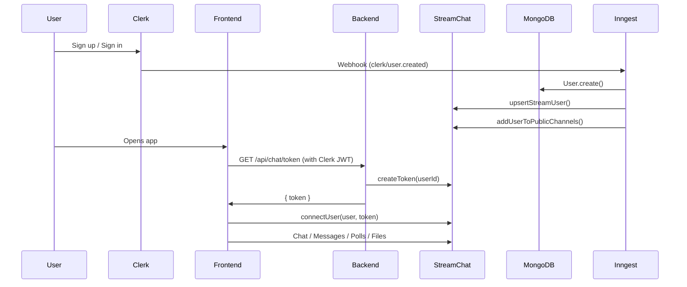

# Hubble - Proje Dokümantasyonu

> Bu doküman projenin tamamını özetler. AI asistanın her seferinde projeyi yeniden analiz etmesine gerek kalmaması için hazırlanmıştır.

---

## Genel Bakış

**Hubble** (UI'da "Slap" olarak da geçer) bir gerçek zamanlı mesajlaşma ve video görüşme uygulamasıdır.

**Temel Özellikler:**

- Gerçek zamanlı mesajlaşma (thread, reaction, pin)
- Dosya paylaşımı (resim, PDF, ZIP vb.)
- Anket/Poll oluşturma (Stream Chat built-in)
- 1-1 ve grup video görüşmeleri (ekran paylaşımı + kayıt)
- Public & Private kanallar
- Direct Message (DM)
- Clerk ile kimlik doğrulama
- Sentry ile hata takibi
- Inngest ile arka plan işleri

---

## Teknoloji Stack'i

| Katman                 | Teknoloji              | Versiyon                   |
| ---------------------- | ---------------------- | -------------------------- |
| **Frontend Framework** | React + Vite           | React 19, Vite 7           |
| **CSS**                | Tailwind CSS v4        | `@tailwindcss/vite` plugin |
| **Mesajlaşma**         | Stream Chat React      | v13.3.0                    |
| **Video**              | Stream Video React SDK | v1.19.2                    |
| **Auth**               | Clerk                  | `@clerk/clerk-react` v5.37 |
| **Backend**            | Express.js             | v5.1.0                     |
| **Database**           | MongoDB + Mongoose     | v8.16.5                    |
| **Arka Plan**          | Inngest                | v3.40.1                    |
| **Hata Takibi**        | Sentry                 | v10.1.0                    |
| **HTTP Client**        | Axios                  | v1.11.0                    |
| **State**              | TanStack React Query   | v5.83.0                    |
| **Routing**            | React Router v7        | v7.6.3                     |
| **Deploy**             | Vercel (backend)       | `vercel.json` mevcut       |

---

## Proje Yapısı

```
Hubble/
├── backend/
│   ├── instrument.mjs          # Sentry initialization (node)
│   ├── vercel.json             # Vercel deployment config
│   ├── package.json
│   └── src/
│       ├── server.js           # Express app, routes, middleware
│       ├── config/
│       │   ├── env.js          # Environment variables export
│       │   ├── db.js           # MongoDB connection
│       │   ├── stream.js       # Stream Chat server client (upsert/delete user, token, public channels)
│       │   └── inngest.js      # Inngest functions (sync user, delete user)
│       ├── controllers/
│       │   └── chat.controller.js  # GET /api/chat/token → Stream token üretir
│       ├── middleware/
│       │   └── auth.middleware.js  # Clerk auth kontrolü (protectRoute)
│       ├── models/
│       │   └── user.model.js      # Mongoose User schema (email, name, image, clerkId)
│       └── routes/
│           └── chat.route.js      # /api/chat/token route
│
├── frontend/
│   ├── index.html
│   ├── vite.config.js          # Vite + React + Tailwind v4 plugin
│   ├── package.json
│   └── src/
│       ├── main.jsx            # App entry: Clerk, Router, QueryClient, Sentry, AuthProvider
│       ├── App.jsx             # Route definitions (/, /auth, /call/:id)
│       ├── index.css           # @import "tailwindcss" (Tailwind v4)
│       │
│       ├── providers/
│       │   └── AuthProvider.jsx    # Axios interceptor: Clerk token → Authorization header
│       │
│       ├── hooks/
│       │   └── useStreamChat.js    # Stream Chat client bağlantısı (connectUser)
│       │
│       ├── lib/
│       │   ├── axios.js            # Axios instance (VITE_API_BASE_URL)
│       │   └── api.js              # getStreamToken() → GET /api/chat/token
│       │
│       ├── pages/
│       │   ├── AuthPage.jsx        # Login sayfası (Clerk SignInButton)
│       │   ├── HomePage.jsx        # Ana sayfa: Chat, ChannelList, MessageList, MessageInput
│       │   └── CallPage.jsx        # Video görüşme sayfası (Stream Video SDK)
│       │
│       ├── components/
│       │   ├── CreateChannelModal.jsx   # Kanal oluşturma (public/private, üye seçimi)
│       │   ├── CustomChannelHeader.jsx  # Kanal başlığı (üyeler, pin, video çağrı)
│       │   ├── CustomChannelPreview.jsx # Sidebar'da kanal önizleme
│       │   ├── InviteModal.jsx          # Private kanala üye davet etme
│       │   ├── MembersModal.jsx         # Kanal üye listesi
│       │   ├── PinnedMessagesModal.jsx  # Pinlenmiş mesajlar
│       │   ├── UsersList.jsx            # DM kullanıcı listesi (sidebar)
│       │   └── PageLoader.jsx           # Yükleme spinner
│       │
│       └── styles/
│           ├── auth.css                 # AuthPage stilleri
│           └── stream-chat-theme.css    # ~995 satır özel tema (sidebar, mesaj alanı, modallar)
```

---

## Veri Akışı



---

## Sayfa & Route Yapısı

| Route       | Sayfa      | Auth | Açıklama                       |
| ----------- | ---------- | ---- | ------------------------------ |
| `/`         | `HomePage` | ✅   | Ana chat ekranı                |
| `/auth`     | `AuthPage` | ❌   | Giriş sayfası                  |
| `/call/:id` | `CallPage` | ✅   | Video görüşme                  |
| `*`         | Redirect   | —    | Auth durumuna göre yönlendirme |

---

## Backend API

| Method | Endpoint          | Middleware     | Controller       | Açıklama                 |
| ------ | ----------------- | -------------- | ---------------- | ------------------------ |
| `GET`  | `/api/chat/token` | `protectRoute` | `getStreamToken` | Stream Chat token üretir |
| `POST` | `/api/inngest`    | Inngest serve  | —                | Inngest webhook handler  |

> **Not:** Backend çok minimal, sadece token üretimi ve kullanıcı senkronizasyonu yapar. Tüm gerçek zamanlı mesajlaşma Stream Chat API üzerinden doğrudan client-side çalışır.

---

## Inngest Background Jobs

| Fonksiyon             | Event                | İşlev                                                                |
| --------------------- | -------------------- | -------------------------------------------------------------------- |
| `sync-user`           | `clerk/user.created` | MongoDB'ye kullanıcı ekle, Stream'e upsert et, public kanallara ekle |
| `delete-user-from-db` | `clerk/user.deleted` | MongoDB ve Stream'den kullanıcıyı sil                                |

---

## Stream Chat Kullanımı (Frontend)

- **`useStreamChat` hook** → `StreamChat.getInstance()` + `connectUser()`
- **`Chat`** → Stream Chat provider
- **`Channel`** → Aktif kanal context
- **`ChannelList`** → Kanal listesi (filtreli)
- **`MessageList`** → Mesaj listesi
- **`MessageInput`** → Mesaj giriş (varsayılan, özelleştirilmemiş)
- **`Thread`** → Thread yanıtları
- **`Window`** → Mesaj alanı wrapper

### Anket (Poll) Durumu

Stream Chat React v13 **polls desteğini built-in** olarak sağlar. `MessageInput` bileşeni otomatik olarak poll oluşturma butonunu gösterir. Poll oluşturma dialog'u açılır ve anket oluşturulabilir.

**Sorun:** Kullanıcı anket açabildiğini ama gönderemediğini, kırmızı ünlem işareti çıktığını ve 201 yanıtı döndüğünü belirtiyor.

**Olası Sebepler:**

1. **Stream Dashboard'da Poll izinleri** → Stream Dashboard > Chat > Roles & Permissions bölümünde `CreatePoll`, `CastVote`, `QueryPollVotes` izinleri açık olmayabilir
2. **Channel type ayarları** → `messaging` channel type'ında poll desteği aktif olmayabilir
3. **201 Created yanıtı** aslında başarılı demek; kırmızı ünlem mesajın lokal olarak fail olmasından kaynaklanıyor olabilir (mesaj içinde poll attachment render hatası)
4. **CSS sorunu** → Poll bileşeninin CSS'leri stream-chat-react v2 temasıyla çakışıyor olabilir

---

## Stil Sistemi

- **Tailwind v4** → `@tailwindcss/vite` plugin ile, `@import "tailwindcss"` syntax
- **`stream-chat-theme.css`** → ~995 satırlık özel tema (glassmorphism, backdrop-filter, gradient'ler)
- **`auth.css`** → Login sayfası stilleri
- Bileşenlerde inline Tailwind class'ları ve özel CSS karışık kullanılıyor

---

## Bilinen Sorunlar & Eksiklikler

1. **Anket gönderimi hatası** → Yukarıda açıklandı
2. **`CustomChannelPreview`** → DM kanallarını gizliyor (`isDM → return null`), channel adı olarak `channel.data.id` gösteriyor (slug formatında)
3. **`UsersList`** → Her render'da `client.channel()` çağırıyor (performans sorunu)
4. **Responsive CSS** → `stream-chat-theme.css` responsive bölümü hala eski padding/border-radius değerlerini referans alıyor (fullscreen değişiklik sonrası uyumsuz)
5. **Error handling** → Çoğu yerde sadece `console.log`, kullanıcıya toast gösterilmiyor
6. **Brand tutarsızlığı** → AuthPage'de "Hubble", sidebar'da "Slap" yazıyor
7. **Tailwind + Custom CSS karışımı** → Bazı bileşenler inline Tailwind, bazıları custom class kullanıyor (tutarsız)

---

## Geliştirme Önerileri

### 🔴 Kritik (Hemen Yapılmalı)

1. **Poll sorununu çöz** → Stream Dashboard permissions kontrolü, CSS çakışma debug
2. **Responsive CSS'leri güncelle** → Fullscreen layout sonrası eski responsive kurallar uyumsuz
3. **Brand ismini birleştir** → "Hubble" veya "Slap" olarak tek bir isim belirle

### 🟡 Orta Öncelik

4. **Kullanıcıya anlamlı hata mesajları göster** → `toast.error()` ekle
5. **`UsersList` performans** → Her render'da channel oluşturmayı önle
6. **Stil tutarlılığı** → Ya tamamen Tailwind ya tamamen custom CSS kullan
7. **Dark mode support** → Chat main area şu an beyaz arka planlı, sidebar koyu
8. **Typing indicator** → Stream'in built-in typing indicator'ını görünür yap
9. **`MessageInput` özelleştir** → Emoji picker, file upload preview iyileştirmeleri

### 🟢 Düşük Öncelik / Gelecek Özellikler

10. **User profil sayfası** → Profil düzenleme, avatar değiştirme
11. **Kanal arama** → Sidebar'da kanal arama
12. **Bildirimler** → Push notification desteği
13. **Mesajları düzenleme/silme** UI → Stream bunu destekler
14. **Emoji reactions** → Mesajlara emoji reaction ekleme UI
15. **Admin paneli** → Kanal yönetimi, kullanıcı ban

---

## Ortam Değişkenleri

### Backend (`.env`)

```
PORT=5001
MONGO_URI=...
NODE_ENV=development
CLERK_PUBLISHABLE_KEY=...
CLERK_SECRET_KEY=...
STREAM_API_KEY=...
STREAM_API_SECRET=...
SENTRY_DSN=...
INNGEST_EVENT_KEY=...
INNGEST_SIGNING_KEY=...
CLIENT_URL=http://localhost:5173
```

### Frontend (`.env`)

```
VITE_CLERK_PUBLISHABLE_KEY=...
VITE_STREAM_API_KEY=...
VITE_SENTRY_DSN=...
VITE_API_BASE_URL=http://localhost:5001/api
```

---

## Çalıştırma

```bash
# Backend
cd backend && npm install && npm run dev

# Frontend
cd frontend && npm install && npm run dev
```

Frontend: `http://localhost:5173` | Backend: `http://localhost:5001`
